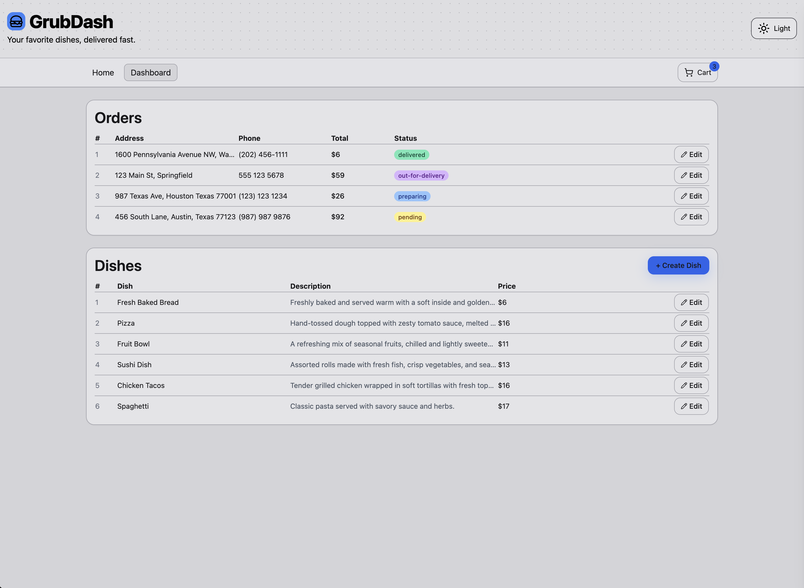
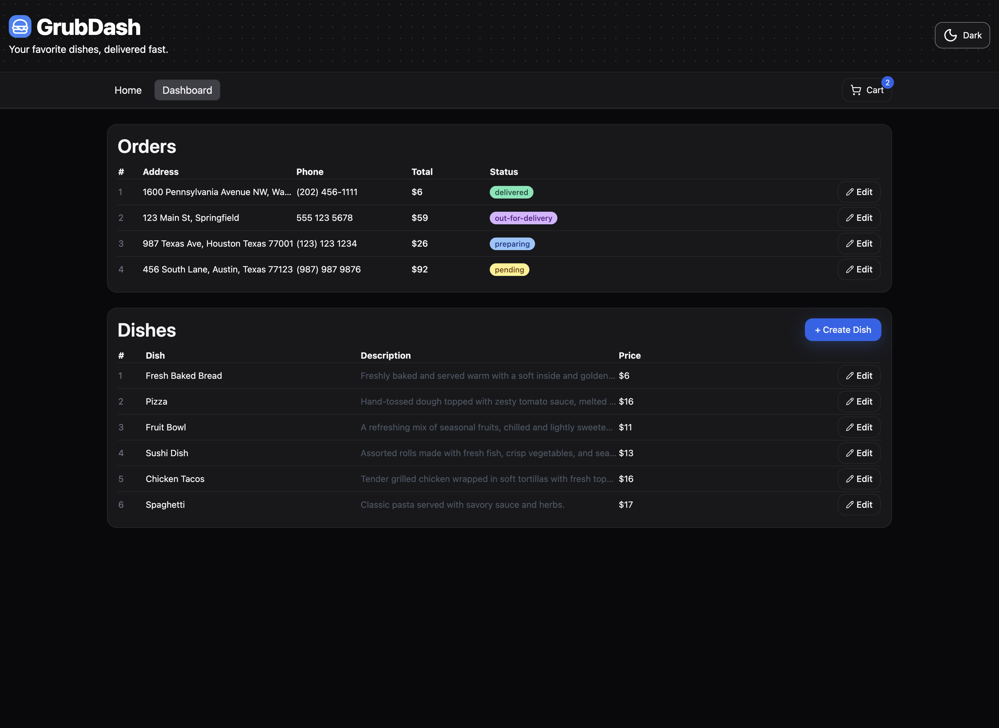

# 🍔 GrubDash

GrubDash is a full-stack food ordering application where users can browse dishes, add them to a cart, and place orders.
It features a modern React + TypeScript frontend, a .NET 9 + Entity Framework Core backend, and a PostgreSQL database hosted on Neon.
The app is deployed with Fly.io (backend) and Vercel (frontend).

 <!-- optional: replace with an actual screenshot -->

---

## ✨ Features

- 📱 **Modern UI** built with React, TypeScript, TailwindCSS, and Lucide icons
- 🌗 **Dark / Light theme toggle** with smooth transitions
- 🛒 **Cart system** with add, update, remove, and clear functionality
- 🧾 **Order management** – users can create, view, update, and delete orders
- 📦 **Dish management** – create, edit, and delete menu items
- 🔐 **Persistent storage** via PostgreSQL with EF Core migrations
- ☁️ **Cloud deployment** – API on Fly.io and frontend on Vercel

---

## 🏗️ Tech Stack

### Frontend
- [React](https://react.dev/) + [TypeScript](https://www.typescriptlang.org/)
- [Vite](https://vitejs.dev/) build tool
- [TailwindCSS](https://tailwindcss.com/) for styling
- [Lucide](https://lucide.dev/) icons
- [TanStack Query](https://tanstack.com/query) for data fetching
- [Sonner](https://sonner.emilkowal.ski/) for toasts

### Backend
- [.NET 9](https://dotnet.microsoft.com/)
- [Entity Framework Core](https://learn.microsoft.com/en-us/ef/core/) with PostgreSQL provider
- Minimal API with Swagger docs
- [Fly.io](https://fly.io/) deployment

### Database
- [PostgreSQL](https://www.postgresql.org/) hosted on [Neon](https://neon.tech/)

---

## 🚀 Live Demo

- **Frontend:** [https://grubdash-alpha.vercel.app](https://grubdash-alpha.vercel.app)
- **Backend API:** [https://grubdash-api.fly.dev/health](https://grubdash-api.fly.dev/health)

---

## 🛠️ Local Development

### Prerequisites
- Node.js 20+
- .NET 9 SDK
- PostgreSQL 16+ (local or remote)

### Setup

1. **Clone the repo**
   ```bash
   git clone https://github.com/falvarado7/grubdash.git
   cd grubdash

2. **Frontend**
   ```bash
   cd web
   npm install
   npm run dev

3. **Backend**
   ```bash
   cd server/GrubDash.Api
   export ASPNETCORE_URLS="http://localhost:5121"
   dotnet run

4. **Database**
   Make sure PostgreSQL is running locally (or configure a Neon connection string).
   Update appsettings.Development.json:

   {
     "ConnectionStrings": {
        "Default": "Host=localhost;Port=5433;Database=grubdash;Username=postgres;Password=postgres"
      }
   }

   Run migrations:
   dotnet ef database update --project ../GrubDash.Data --startup-project

5. Open http://localhost:5173 (frontend) and http://localhost:5121/health (backend)



